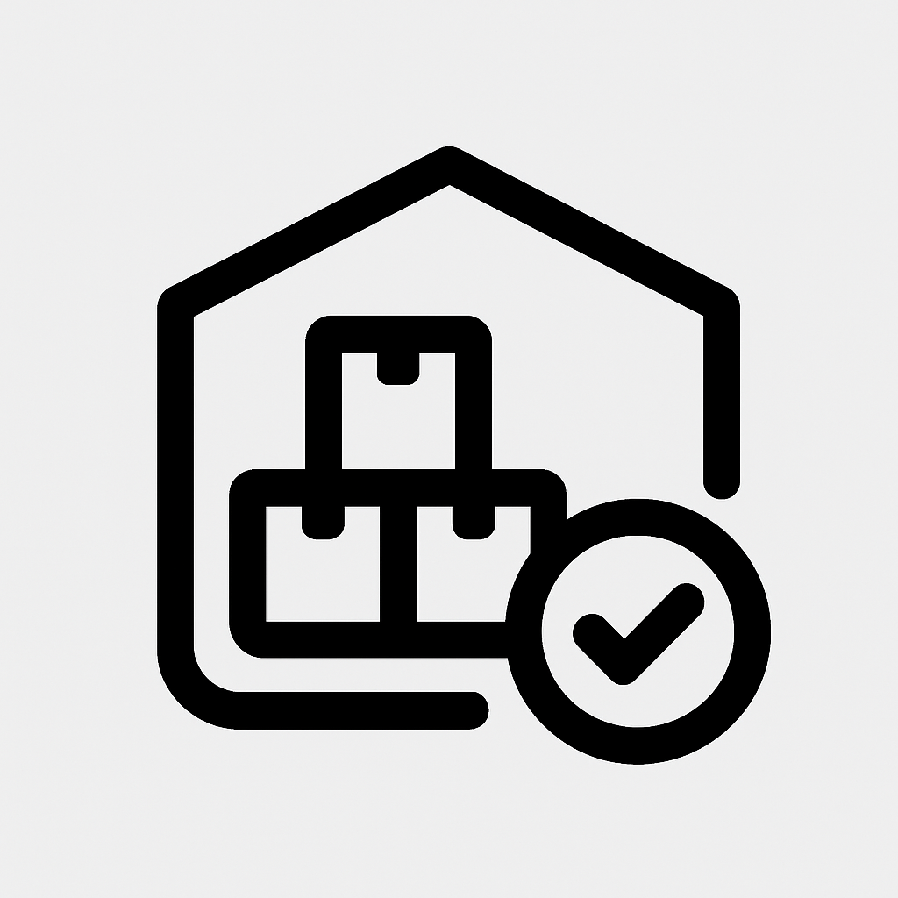

#  TechStok - Controle de Estoque para TI
Um sistema de gerenciamento de estoque simples, eficiente e moderno, desenvolvido para facilitar o controle de equipamentos, categorias e movimentações.
#### <a href="https://controle-de-estoque-blue.vercel.app/">Clique aqui para acessar esse projeto</a>
## 🚀 Funcionalidades
* 💻 <strong>Cadastro de Equipamentos</strong> - ID, nome, categoria, marca, modelo, detalhes e quantidade.
* 🗂️ <strong>Gestão de Categorias</strong> - Organize equipamentos por categorias predefinidas.
* ✏️ <strong>Controle de Edições</strong> - Registro de alterações (edição, criação, exclusão). Filtros por data, nome, tipo de ação e etc.
* 🛎️ <strong>Alertas Inteligentes</strong> - Mensagens de feedback durante o uso da aplicação.
* 📋 <strong>Segurança no envio de dados</strong> - Validações client-side para prevenir erros e manter a integridade dos dados enviados.
* 📊 <strong>Relatórios e Dashboard</strong> - Filtragem e exportação de tabelas para arquivos CSV através de um dashboard de fácil compreensão.
* 🌙 <strong>Tema Escuro/Claro</strong> - Interface adaptável para melhor experiência visual.

## 🛠️ Tecnologias e Bibliotecas Utilizadas
## Frontend: 
* <strong>React.js e Typescript (Vite build)</strong>
* <strong>Axios</strong> - Client HTTP para requisições assíncronas.
* <strong>Zustand</strong> - Gerenciamento de estado leve, baseado em hooks.
* <strong>Shadcn e TailwindCSS</strong> - Importação e estilização de componentes de forma leve e versátil.
* <strong>Papaparse</strong> - Exportação de tabelas (JSON) para formato CSV.
* <strong>Uuid</strong> -  Identificadores únicos para usuários da aplicação (não aplicado aos equipamentos devido a estrutura já padronizada do back-end).
* <strong>React Hook Form e Zod</strong> - Gerenciamento e validação de formuláros.
* <strong>React Icons</strong> - Biblioteca de Ícones diversos.

### Backend/Banco de dados: 
* <a href="https://mockapi.io/projects">MockAPI</a> - serviço de hospedagem de APIs simples

### Deploy: 
* Vercel

## ▶️ Como rodar o projeto na minha máquina? 
- Abra o terminal no diretório do projeto.
- Execute `npm install` para instalar as dependências.
- Em seguida, rode `npm run dev` para iniciar o ambiente de desenvolvimento.
- O projeto será acessível automaticamente em toda a rede local.